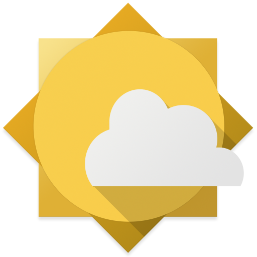
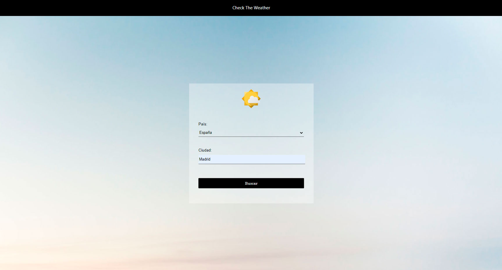
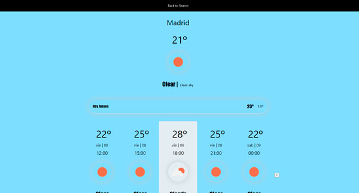
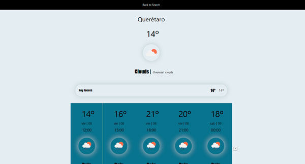
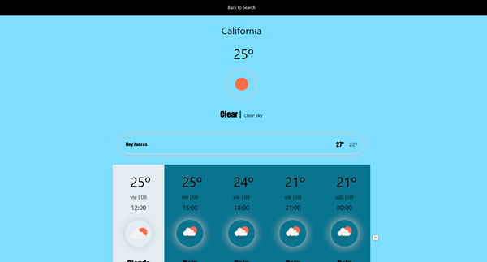

# Weather APP 

# Introduction

Weather Application is a simple app that takes the weather data from an API so you can know if is a sunny or a cloudy day in the place you may be interested in.

# How to build

1. Clone the repository

$ git clone https://github.com/aitorulz1/weather-app.git

2. Install dependencies

$ git init

3. Open the workspace in VSC

$ code .

4. Run the application

$ npm start

# Instructions

As simple as it seems. Just select a country and the type the city you want (belonging to that country) and press start. Immediatly will appear the weather for the next 7 days!

# Screenshots

